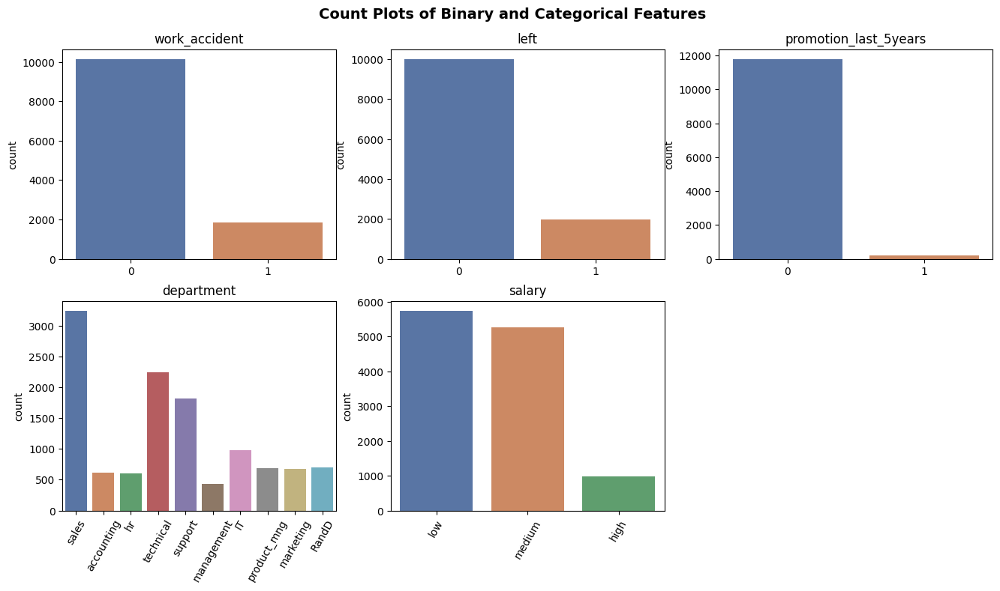

# Salifort Motors Employee Retention Project

## Introduction
In the final capstone project of the Google Advanced Data Analytics Professional Certificate, I will be working on the **Salifort Motors Employee Retention Project**.

I will be working on this project using the **PACE (Plan, Analyse, Construct, Execute) framework** that was being taught in this course.

[Plan Stage](#plan): Involves understanding the data in the problem context 

[Analyse Stage](#analyse): Involves exploratory data analysis, checking model assumptions and selecting of model 

[Construct Stage](#construct): Involves constructing the model and evaluation of the model

[Execute Stage](#execute): Involves interpreting the model and sharing the story

## Plan
### About Salifort Motor
Salifort Motors is a fictional French-based alternative energy vehicle manufacturer. Its global workforce of over 100,000 employees research, design, construct, validate, and distribute electric, solar, algae, and hydrogen-based vehicles. Salifort’s end-to-end vertical integration model has made it a global leader at the intersection of alternative energy and automobiles.

### Business Task
As a data specialist working for Salifort Motors, you have received the results of a recent employee survey. The senior leadership team has tasked you with analyzing the data to come up with ideas for how to increase employee retention as it is time-consuming and expensive to find, interview, and hire new employees and increasing employee retention will be beneficial to the company. To help with this, they would like you to design a model that predicts whether an employee will leave the company based on their department, number of projects, average monthly hours, and any other data points you deem helpful. 

### Deliverable
1. Analyse and identify factors that contribute to employees leaving the company
2. Construct a regression model or a tree-based machine learning model to predict whether an employee will leave the company
3. Ideas to increase employee retention

### Dataset
We will be using the `HR_capstone_dataset.csv` dataset which can be found [here](https://www.kaggle.com/datasets/mfaisalqureshi/hr-analytics-and-job-prediction?select=HR_comma_sep.csv), where there are 14,999 rows, 10 columns, and these variables: 

Variable  |Description |
-----|-----| 
satisfaction_level|Employee-reported job satisfaction level [0–1]|
last_evaluation|Score of employee's last performance review [0–1]|
number_project|Number of projects employee contributes to|
average_monthly_hours|Average number of hours employee worked per month|
time_spend_company|How long the employee has been with the company (years)
Work_accident|Whether or not the employee experienced an accident while at work
left|Whether or not the employee left the company
promotion_last_5years|Whether or not the employee was promoted in the last 5 years
Department|The employee's department
salary|The employee's salary (U.S. dollars)

### Findings

1. There seems to be outlier for the variable `tenure`.

    

2. The proportion of people getting promoted over the last 5 years is very low.

    

## Analyse

In the analyse phase, we will conduct EDA to analyse and identify factors that contribute to employees leaving the company

### Findings

1. For individuals working on the same number of project, those who left that worked on very little project have significantly lower average monthly hours than those that stayed. Those who left that worked on a lot of project had higher average monthly hours that those that stayed. Everyone who worked on seven projects left the company and in general, the employees of the company seems overworked when compared to the nominal working hours of 166.67 hours / mth.

    

2. For individuals that left, there was one prominent group where the hours worked monthly was below average and their satisfaction was around 0.4. The other prominent group was those that was severly overworked, working between 240-310 hours per month and their satisfaction is near zero suggesting that those who left generally have a lower satisfaction level and part of the reason could be due to severe overworking.

    

3. For individuals that left, they were generally either dissatisfied employees with shorter tenure or very satisfied employees with medium length tenure. An unique observation is that four-year employees who left seemed to have a very low satisfaction and also, the longest tenure employees did not leave.

    

4. For individuals that left and were earning low or medium salary, they tend to have a longer working hour as compared to people that stayed suggesting that they may feel that they are are not properly compensated for the amount of work that they are doing.

    
    
5. For individuals that left, there either had low evaluation score and was working below nominal working hours or they had high evaluation score and was severely overworked. This suggest that while having high evaluation score can mean better performance, this often come at a cost of higher monthly hours which can lead to employees leaving.

    

6. For individuals that left, they were mainly not promoted over the last 5 years.

    

7. There doesn't seem to be any department that differs significantly in its proportion of employees who left to those who stayed.

    

## Constuct

In the construct phase, we build a logistic regression model as well as two tree-based machine learning model (Decision Tree and Random Forest) using `left` as the target variable to predict whether an employee will leave the company. To optimize the performance of the Decision Tree and Random Forest models, I performed hyperparameter tuning using the ROC AUC as the evaluation metric.

### Findings
The random forest model was chosen as the best model and below is the confusion matrix. The decision tree model achieved AUC of 93.8%, precision of 87.0%, recall of 90.4%, f1-score of 88.7%, and accuracy of 96.2%, on the test set.
    

## Execute

In the execute phase, we focused on sharing the results of the model as well as to provide ideas to increase employee retention.

The result of the model can be seen above.

### Recommendations

As for ideas to retain employees, these were the recommendations:
    
1. Cap the number of projects that employees can work on where employees should ideally only work up till 5 projects.
2. Consider promoting employees who have been with the company for at least four years.
3. Either reward employees for working longer hours by offering them higher salary, or setting a restriction on the max allowable working hours per month.
4. Hold company-wide and within-team discussions to understand and address the company work culture, across the board and in specific contexts. 
5. High evaluation scores should not be reserved for employees who work 200+ hours per month. Consider a proportionate scale for rewarding employees who contribute more/put in more effort. 
