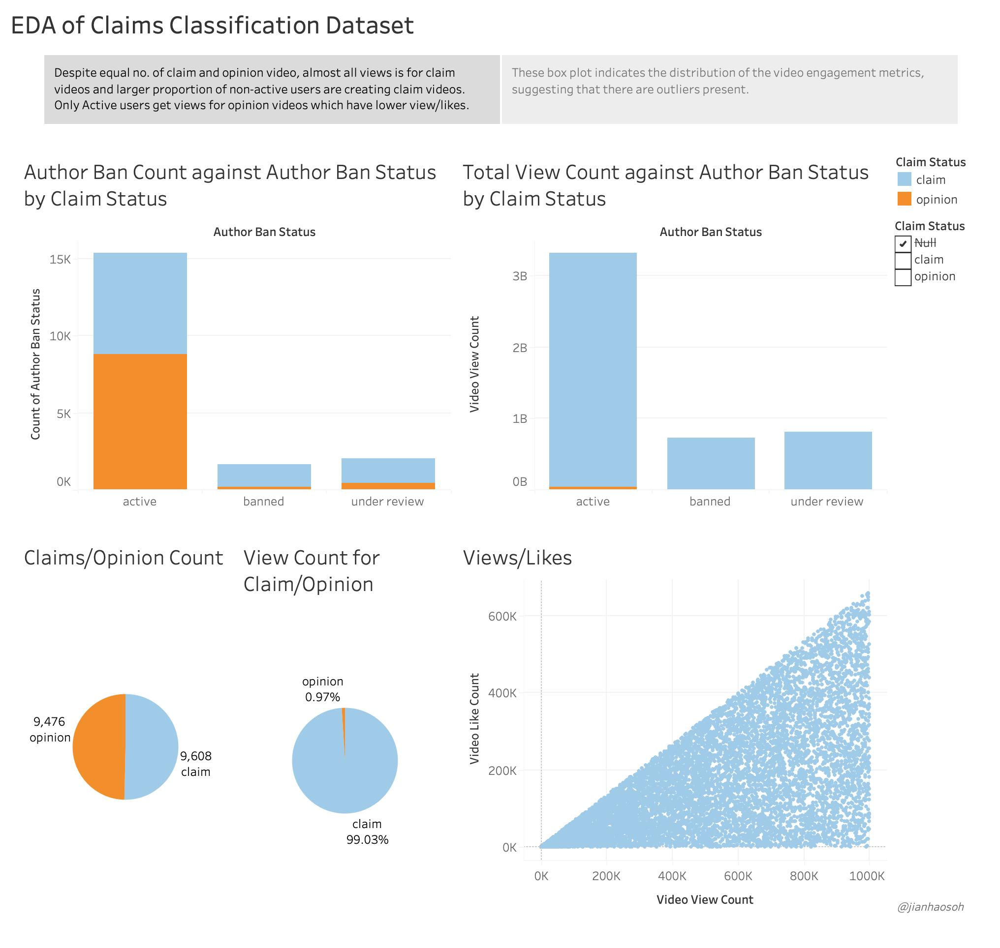
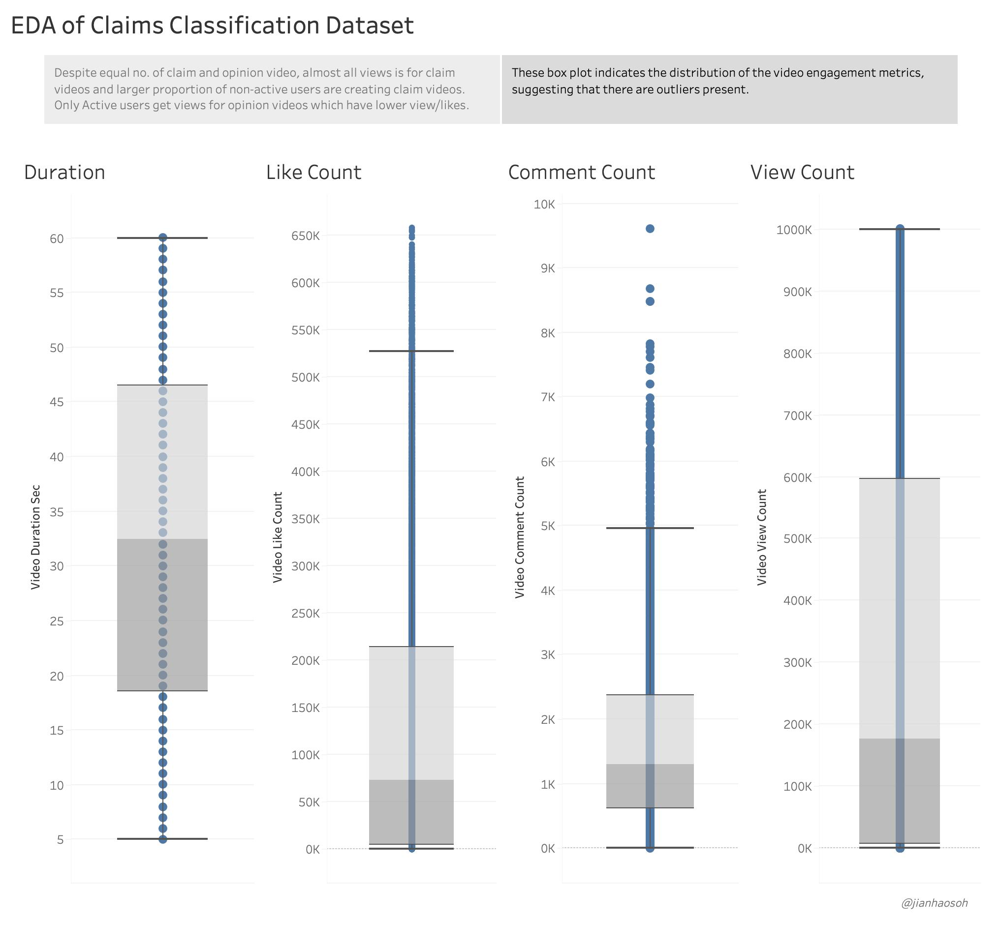
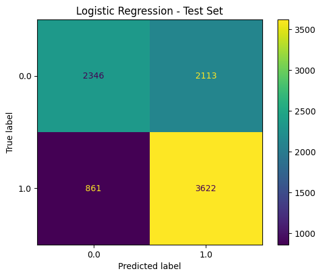
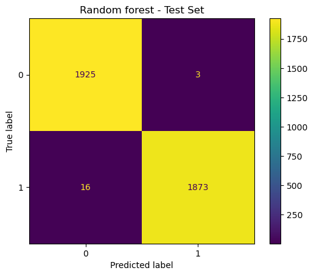

# TikTok Claims Classification Project

## Introduction
In the first six courses of the Google Advanced Data Analytics Professional Certificate, each course consist of an end-of-course portfolio project related to an workplace scenario. These projects are interconnected, building upon one another to create a comprehensive portfolio project. 

For my portfolio project, I will be working on the **TikTok Claims Classification Project**.

## Background on TikTok Scenario
At TikTok, our mission is to inspire creativity and bring joy. Our employees lead with curiosity and move at the speed of culture. Combined with our company's flat structure, you'll be given dynamic opportunities to make a real impact on a rapidly expanding company and grow your career.

TikTok users can report videos that they believe violate the platform's terms of service. Because there are millions of TikTok videos created and viewed every day, this means that many videos get reported&mdash;too many to be individually reviewed by a human moderator.

Analysis indicates that when authors do violate the terms of service, they're much more likely to be presenting a claim than an opinion. Therefore, it is useful to be able to determine which videos make claims and which videos are opinions.

TikTok wants to build a machine learning model to help identify claims and opinions. Videos that are labeled opinions will be less likely to go on to be reviewed by a human moderator. Videos that are labeled as claims will be further sorted by a downstream process to determine whether they should get prioritized for review. For example, perhaps videos that are classified as claims would then be ranked by how many times they were reported, then the top x% would be reviewed by a human each day.

A machine learning model would greatly assist in the effort to present human moderators with videos that are most likely to be in violation of TikTok's terms of service.

## Course 1 Project Deliverable
File: `TikTok_project_proposal.pdf`

A project proposal that will create milestones for the tasks within the comment classification project, taking into account your audience, team, project goal, and PACE stages of each task in planning your project deliverable.

## Course 2 Project Deliverable
File: `course_2_project_lab.ipynb`

Understand the data needed for the project and build a dataframe for the claims classification data. After the dataframe is complete, organize the claims data for the process of exploratory data analysis, and update the team on your progress and insights.

## Course 3 Project Deliverable
File: `course_3_project_lab.ipynb`

Conduct exploratory data analysis on data for the claims classification project and make use of Tableau to create visuals for an executive summary to help non-technical stakeholders engage and interact with the data.

The data story below was created using Tableau, which highlights the key findings from the Exploratory Data Analysis process.

## Course 4 Project Deliverable
File: `course_4_project_lab.ipynb`

Conduct hypothesis testing on the data for the claims classification data and investigate TikTok's user claim dataset to determine which hypothesis testing method best serves the data and the claims classification project.

Over here we conducted a two sample t-test and concluded that there is a statistically significant difference in the mean video view counts from verified and unverified accounts suggesting that there might be fundamental behavioral differences between these two groups of accounts.

## Course 5 Project Deliverable
File: `course_5_project_lab.ipynb`

Create a regression model for the claims classification data and determine the type of regression model that is needed and develop one using TikTok's claim classification data.

Over here, we built a Logistic Regression model with user verification status as the outcome variable. The model result can be seen from the confusion matrix below.

## Course 6 Project Deliverable
File: `course_6_project_lab.ipynb`

Create the final machine learning model for the claims classification data, which include feature engineering, model development, and evaluation. 

Over here, we built two tree-based classification model using the Random Forest and XGBoost algorithm where both models were used to predict on a held-out validation dataset. The Random Forest model was selected as the final model as it had the best recall score (selected evaluation metric). The final model was then used to score a test dataset to estimate future performance. The result can be seen from the confusion matrix below.

